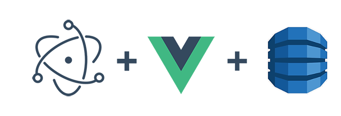

# DynamoDb-GUI-Client
[](#contributors)

## Cross-platform GUI client for DynamoDb

[](https://github.com/Arattian/DynamoDb-GUI-Client/blob/master/LICENSE)

### [Release v3.3.0](https://github.com/Arattian/DynamoDb-GUI-Client/releases/tag/3.3.0)

#### [Download for MacOS (.dmg)](https://github.com/Arattian/DynamoDb-GUI-Client/releases/download/3.3.0/DynamoDbGUI-mac-3.3.0.dmg)

#### [Download for MacOS (.zip)](https://github.com/Arattian/DynamoDb-GUI-Client/releases/download/3.3.0/DynamoDbGUI-mac-3.3.0.zip)

### [Release v2.1.1 || Old UI](https://github.com/Arattian/DynamoDb-GUI-Client/releases/tag/v2.1.1)

#### [Download for Debian (.deb)](https://github.com/Arattian/DynamoDb-GUI-Client/releases/download/v2.1.1/DynamoDbGUI-linux-amd64-2.1.1.deb)

#### [Download for Linux (.AppImage)](https://github.com/Arattian/DynamoDb-GUI-Client/releases/download/v2.1.1/DynamoDbGUI-linux-x86_64-2.1.1.AppImage)



:eyes:


## Run

```bash
git clone https://github.com/Arattian/DynamoDb-GUI-Client.git
cd DynamoDb-GUI-Client
npm i
# Electron serve
npm run electron:serve
# Vue Cli serve
npm start
```

## Build Instructions

```bash
git clone https://github.com/Arattian/DynamoDb-GUI-Client.git
cd Dynamodb-GUI-Client
npm i
# Electron application build(This will build app for your OS)
npm run electron:build
```

## Features

- [x] Remote Access of AWS DynamoDB Service\*
- [x] Local DynamoDB
- [x] Supports multiple databases
- View
  - Table view
    - [x] Records view
    - [x] Table schema view
- Operation

  - Record
    - [x] Add Record
    - [x] Edit Record
    - [x] Delete Record
  - Table
    - [x] Add Table
    - [x] Edit Table
    - [x] Delete Table
  - Filter by attribute value
  - Filter by attribute name

- For remote access, need to provide access and secret keys.All keys stored in localStorage.

## Contributors

Thanks goes to these wonderful people ([emoji key](https://allcontributors.org/docs/en/emoji-key)):

<!-- ALL-CONTRIBUTORS-LIST:START - Do not remove or modify this section -->
<!-- prettier-ignore -->
<table><tr><td align="center"><a href="https://github.com/Arattian"><br /><sub><b>Misak Poghosyan</b></sub></a><br /><a href="#infra-Arattian" title="Infrastructure (Hosting, Build-Tools, etc)">🚇</a> <a href="https://github.com/Arattian/DynamoDb-GUI-Client/commits?author=Arattian" title="Tests">⚠️</a> <a href="#talk-Arattian" title="Talks">📢</a> <a href="#tool-Arattian" title="Tools">🔧</a> <a href="#maintenance-Arattian" title="Maintenance">🚧</a> <a href="https://github.com/Arattian/DynamoDb-GUI-Client/commits?author=Arattian" title="Code">💻</a></td><td align="center"><a href="https://valonhaliti.github.io"><br /><sub><b>Valon Haliti</b></sub></a><br /><a href="https://github.com/Arattian/DynamoDb-GUI-Client/commits?author=valonhaliti" title="Code">💻</a></td></tr></table>

<!-- ALL-CONTRIBUTORS-LIST:END -->

This project follows the [all-contributors](https://github.com/all-contributors/all-contributors) specification. Contributions of any kind welcome!