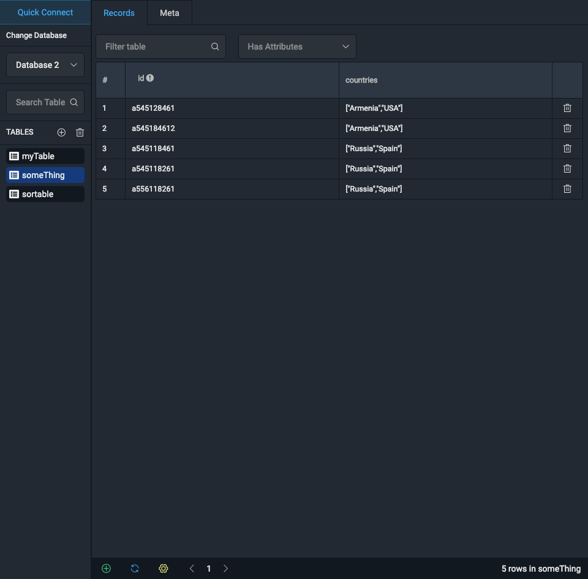

# DynamoDb-GUI-Client
## Cross-platform GUI client for DynamoDb

[](https://github.com/Arattian/DynamoDb-GUI-Client/blob/master/LICENSE)


### [Release v2.1.1](https://github.com/Arattian/DynamoDb-GUI-Client/releases/tag/v2.1.1)
##### [Download for MacOS (.dmg)](https://github.com/Arattian/DynamoDb-GUI-Client/releases/download/v2.1.1/DynamoDbGUI-mac-2.1.1.dmg)

###### As i switched to MacOS and Electron doesn't provide way to build many versions of application on one OS, next releases will contain changes only for MacOS. Or if you want to contribute, you can clone latest version of repo, build it for your OS and provide me download link. I will include it on release versions.

## Build Instructions 

```bash
git clone https://github.com/Arattian/DynamoDb-GUI-Client.git
cd Dynamodb-GUI-Client
# Electron application build(This will build app for your OS)
npm run electron:build
```


:eyes:


## Run

```bash
git clone https://github.com/Arattian/DynamoDb-GUI-Client.git
cd Dynamodb-GUI-Client
npm i
# Electron serve
npm run electron:serve
# Vue Cli serve
npm start
```

## Features

* [x] Remote Access of AWS DynamoDB Service*
* [x] Local DynamoDB
* [x] Supports multiple databases
* View
  * Table view
    * [x] Records view
    * [x] Table schema view
  * [x] JSON view
* Operation
  * Record
    * [x] Add Record
    * [x] Edit Record
    * [x] Delete Record
  * Table
    * [x] Add Table
    * [x] Edit Table
    * [x] Delete Table
  * Filter by attribute value
  * Filter by attribute name

* For remote access, need to provide access and secret keys.All keys stored in localstorage.
